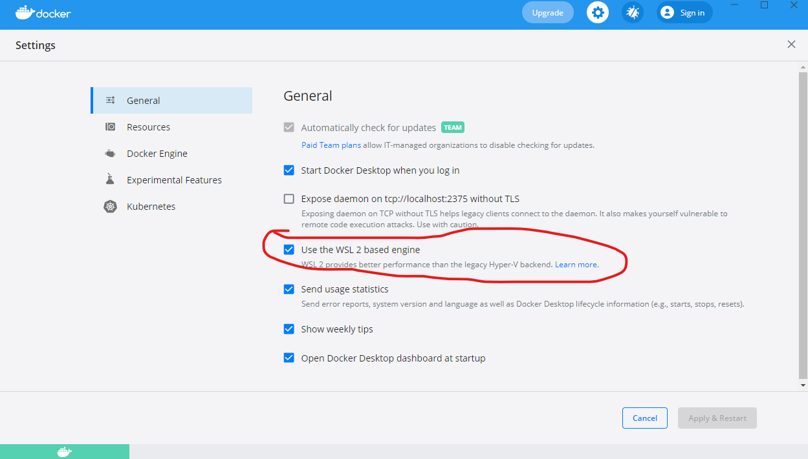
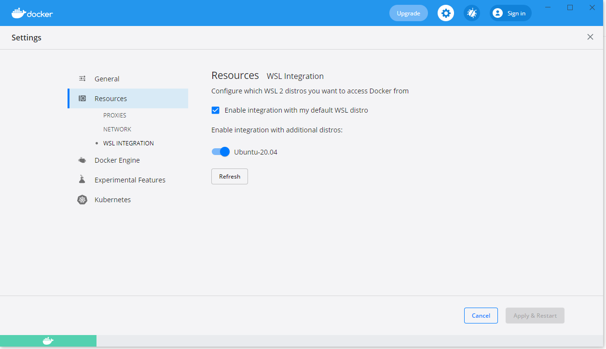

# Docker Desktop setup

Install [Docker desktop](https://www.docker.com/products/docker-desktop) and check you configuration: 

Make sure docker desktop is using wsl2 engine

 
 
Set docker desktop linux distribution integration.

[< back](../README.md)