# Docker Desktop setup

Install [Visual Studio Code](https://code.visualstudio.com/). 

Make sure the following extensions are installed:

* [Docker](https://marketplace.visualstudio.com/items?itemName=ms-azuretools.vscode-docker)
* [Remote - Containers](https://marketplace.visualstudio.com/items?itemName=ms-vscode-remote.remote-containers)
* [Remote - WSL](https://marketplace.visualstudio.com/items?itemName=ms-vscode-remote.remote-wsl)
* [PHP Debug](https://marketplace.visualstudio.com/items?itemName=felixfbecker.php-debug)
* [PHP DocBlocker](https://marketplace.visualstudio.com/items?itemName=neilbrayfield.php-docblocker)
* [PHP Intelephense](https://marketplace.visualstudio.com/items?itemName=bmewburn.vscode-intelephense-client)
* [Twig Language](https://marketplace.visualstudio.com/items?itemName=mblode.twig-language)
* [DotEnv](https://marketplace.visualstudio.com/items?itemName=mikestead.dotenv)
* [GitLens - Git supercharged](https://marketplace.visualstudio.com/items?itemName=eamodio.gitlens)
* [Symfony for VSCode](https://marketplace.visualstudio.com/items?itemName=TheNouillet.symfony-vscode) (Download and install manually from [here](https://github.com/fmarinheiro/symfony-vscode-extension/raw/master/symfony-vscode-1.0.2.vsix))

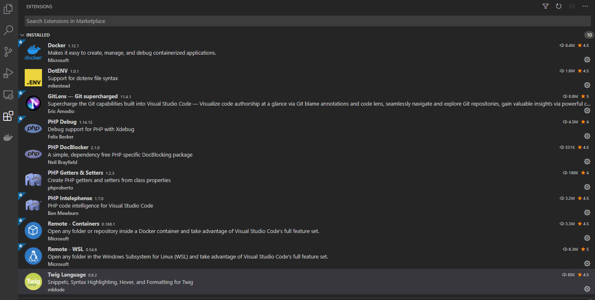

## How to open a project folder on WSL

To work on a project located inside wsl, we recomend you open project folder remotely using the feature provided by `Remote - WSL` extension, to do that follow the steps above:

Open a remote window

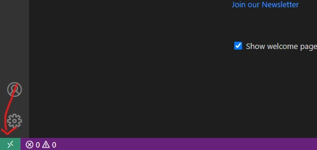

<br>

Select "Remote-WSL: Open Folder in WSL..."

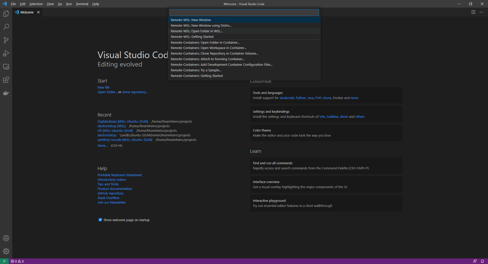

<br>

Select you project's folder, it should be located in a folder under "\\\wsl$\Ubuntu-20.04\home\<username>\projects\\\<your-project-folder>"

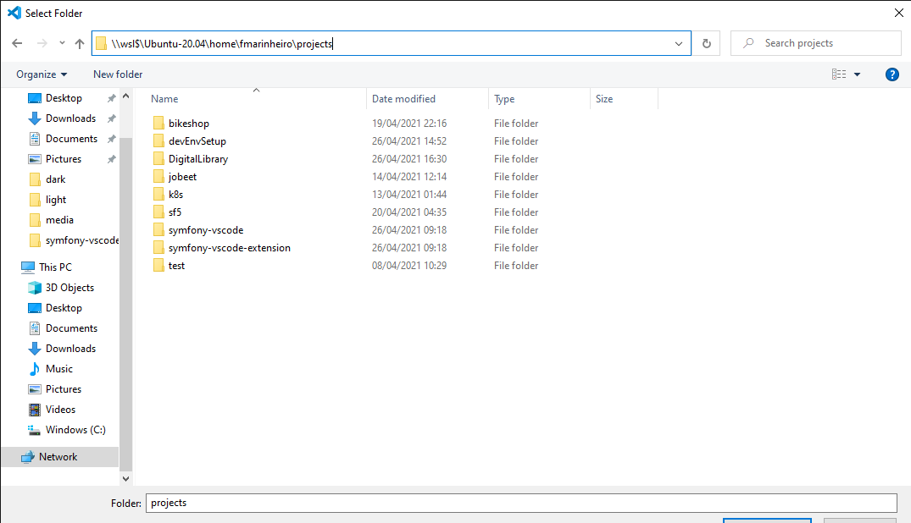

<br>

Select you project's folder, it should be located in a folder under "\\\wsl$\Ubuntu-20.04\home\<username>\projects\\\<your-project-folder>"

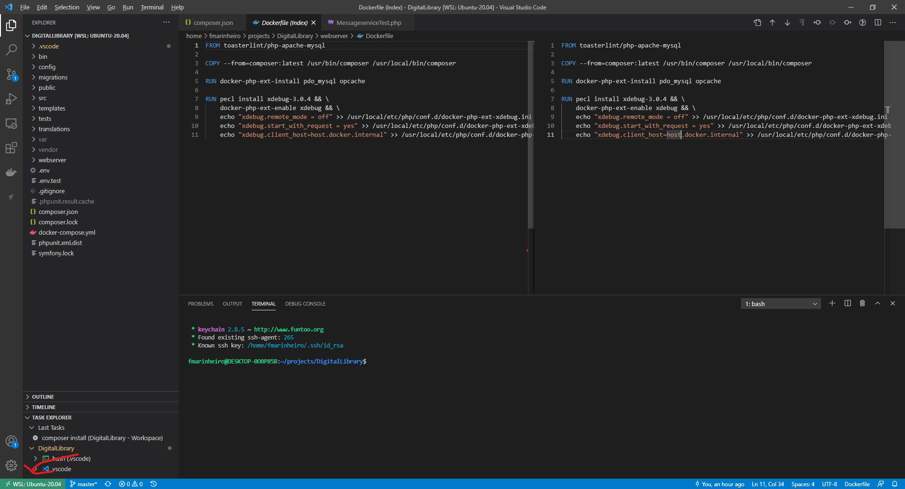

## Missing extensions after opening remote folder on WSL

After opening a remote windows you will need to reinstall the extensions you need for your project, so that they become available for remote development.

Go to the extensions panel and select "Install on WSL: ..." for every extension you miss:

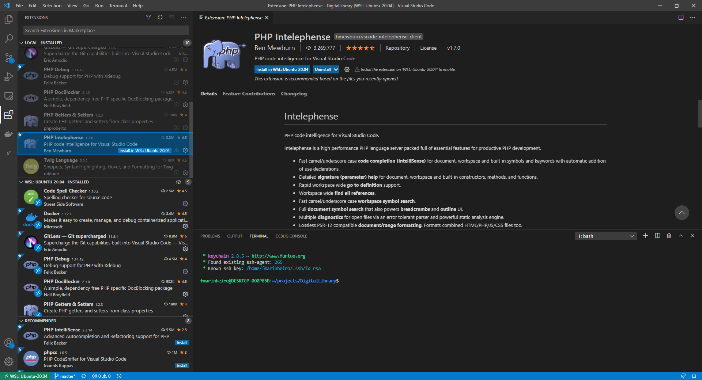

## Configure VSCode PHP executable

Assuming that your project is running inside docker containers (with docker-compose) and your php executable lives inside them, we need to configure how the extensions call it as it is required for them to work properly. 

We will create a wrapper script so that vscode can execute php inside containers without the need to explicitly call docker api. 

First download [this file](../media/php_wrapper.sh) and place it on a `.vscode` on your project's root.

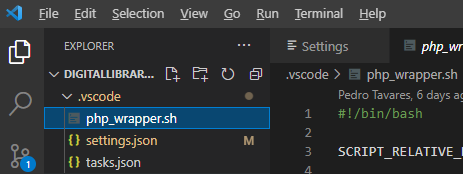 

Edit the file and replace `<REPLACE_WITH_SERVICE_NAME>` with your docker composer service name.

Then in the same folder create a file called `settings.json` and add the following configuration options: 

```
{
    "php.validate.executablePath": "/home/<username>/projects/<project-folder>/.vscode/php_wrapper.sh",
    "symfony-vscode.phpExecutablePath": "/home/<username>/projects/<project-folder>/.vscode/php_wrapper.sh"
}
```

Don't forget to replace the placeholders `<username>` and `<project-folder>` accordingly.

## Configuring VSCode tasks to run Symfony commands (or any other command) on a container

Much like in the the section above (please read `Configure VSCode PHP executable`), your symfony tasks will have to run inside the container where php lives. We can configure as many tasks as you need to run, but as an example we will demonstrate how to configure a couple of tasks and run them from vscode.

First create a file called `tasks.json` inside a `.vscode` folder your project's root with the following content changing the placeholders accordingly: 

```
{
    "version": "2.0.0",
    "tasks": [
        {
            "label": "composer install",
            "type": "shell",
            "command": "docker-compose exec -T -w  <PROJECT_FOLDER_PATH_INSIDE_CONTAINER> <CONTAINER_SERVICE_NAME> composer install"
        },
        {
            "label": "Symfony cache clear",
            "type": "shell",
            "command": "docker-compose exec -T -w  <PROJECT_FOLDER_PATH_INSIDE_CONTAINER> <CONTAINER_SERVICE_NAME>  bin/console cache:clear"
        }
    ]
}
```
To run these tasks you need to select the 'Run Task..' option from the `Terminal` menu, and select the task you want to run.

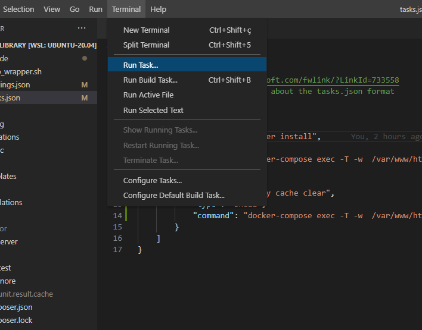 

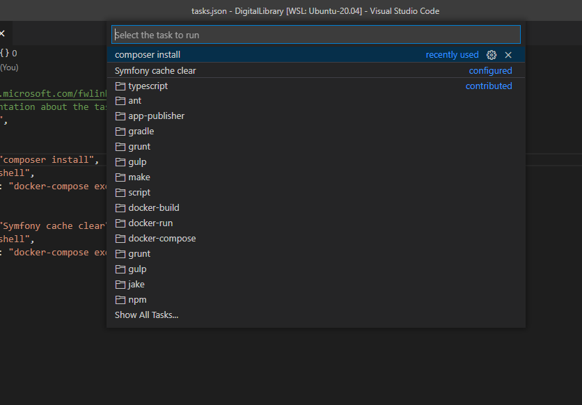 

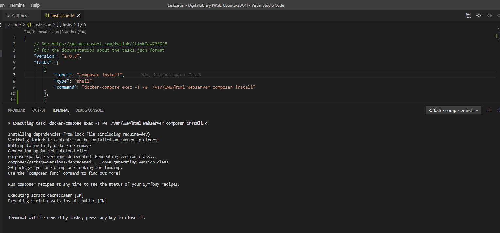 

## Opening a shell in a docker container fom vscode 

Sometime it might be more practical to you to ope a shell on the docker container and execute command directly, the vscode `docker` extension provides as easy way to do this just by selected the option `Attach Shell` on the selected container.

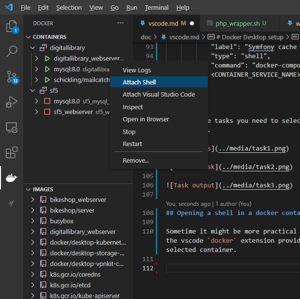 
