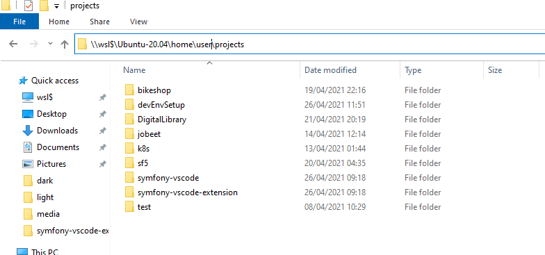

# WSL2 setup

The Windows Subsystem for Linux (WSL) is a feature from Microsoft that enables developers to run a GNU/Linux environment directly on Windows, unmodified, without the overhead of a traditional virtual machine or the dual-boot setup.

To install wsl2 on Windows please follow the steps on the [official setup page](https://docs.microsoft.com/en-us/windows/wsl/install-win10) from microsoft. 
We recomend you to install Ubuntu 20.04 once you get o [step 6](https://docs.microsoft.com/en-us/windows/wsl/install-win10#step-6---install-your-linux-distribution-of-choice) of the guide, but you can install the Linux distribution that suits you better (Ubuntu 20.04 was the distribution used as of the making of this documentation).

## Memory/CPU limit settings

WSL 2 will consume all available resources until your machine begins to overload, and it will not release these resources, sometimes even after a reboot.

The best way to deal with this it's to limit the resources the linux subsystem is allowed to use.

Open Windows Terminal/CMD/PowerShell and run the commands below:
```
# turn off all wsl instances such as docker-desktop
wsl --shutdown
notepad "$env:USERPROFILE/.wslconfig"
```
Edit .wslconfig file with notepad and write down these settings:
```
[wsl2]
memory=3GB   # Limits VM memory in WSL 2 up to 3GB
processors=4 # Makes the WSL 2 VM use four virtual processors
```

## Checking installation

Running the command `wsl -l` on Windows PowerShell should give you an output similar to:

```
Windows Subsystem for Linux Distributions:
Ubuntu-20.04 (Default)
docker-desktop-data
docker-desktop
```
## Workspace folder

Make sure you create you workspace folder inside the home folder of you linux distribution folder. 

Open a shell on you wsl distro and create a folder for your projects:
```
$ cd $HOME && mkdir projects
```
All you projects should be creates inside the `projects` folder in `/home/<username>/projects` 
 
 If you want to access this folder fro the windows exploder you will have to use the path `\\wsl$\Ubuntu-20.04\home\<username>\projects`

 

 Every time you want to work on a project that it's inside this folder you should connect Vscode remotely to this folder on wsl2. Refer to [this page](vscode.md) to see how. 

 [< back](../README.md)